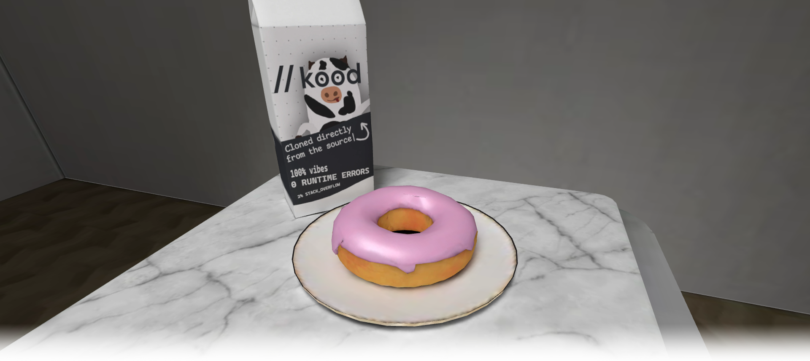
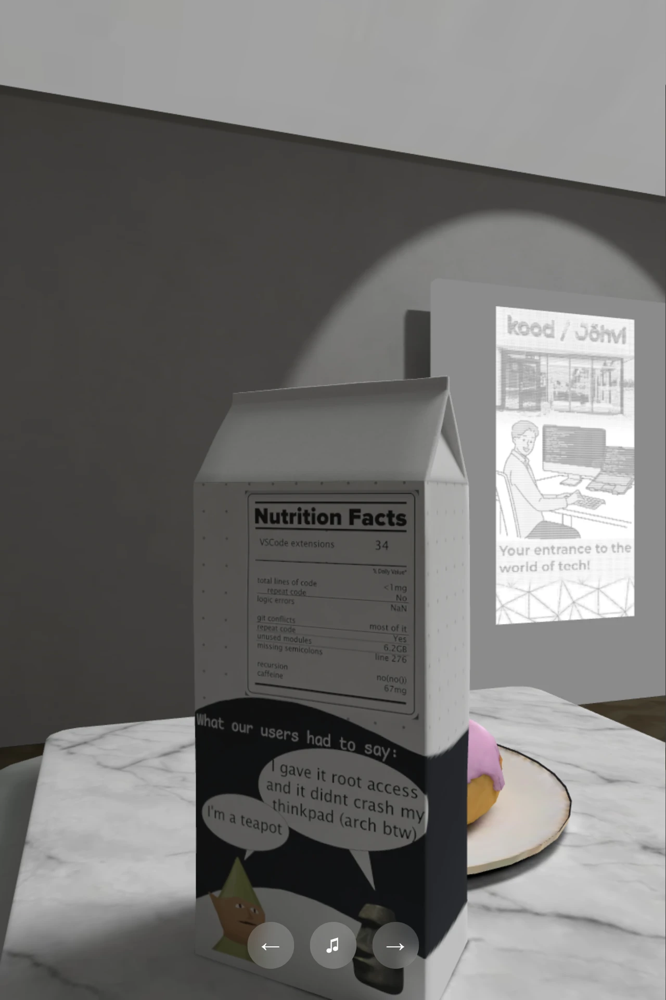
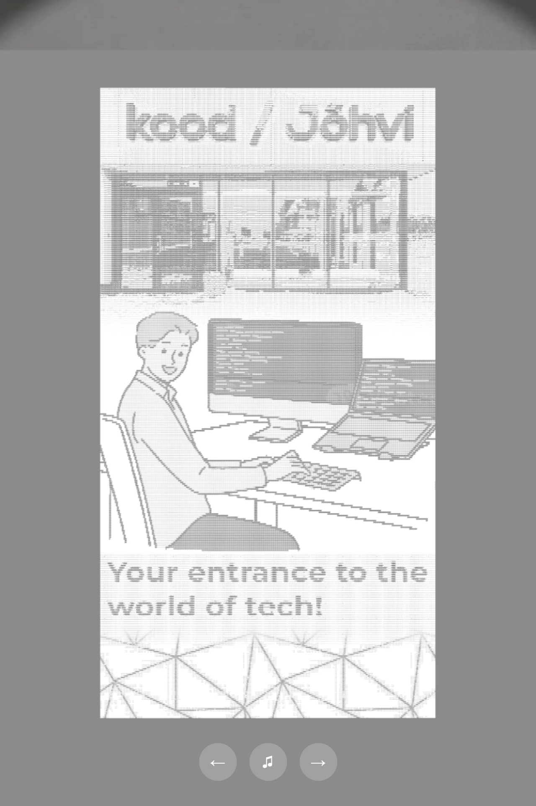

# Orbit Gallery
A virtual art gallery built from scratch in Blender and rendered in the browser using Three.js, The gallery showcases handful of my personal projects as framed wall displays in a full 3D space, complete with baked lighting, custom models, and smooth camera transitions. Designed and optimized for touchscreens but works on any device.

---

🌐 Automatically deployed via GitHub Actions on every push to **https://gallery.tanelneitov.eu**



---

## Features

### Core
- 3D gallery scene created in Blender with baked lighting
- Multiple artworks showcasing school projects or references
- Smooth animated camera transitions between artworks
- Optimized for touchscreen devices

### Extra
- Background classical music with toggle control

### Bonus
- `?tour` mode for public screens - automatically cycles through all artworks
> In tour mode, background music  cannot be toggled off, as it is intended for unattended public screens.

## Artworks

The gallery features four wall displays and one podium exhibit:

- Images of my past projects
- old blender renders when I was learning blender
- **The Podium** - The classic Blender donut from the [official Blender tutorial](https://www.youtube.com/watch?v=B0J27sf9N1Y), a rite of passage for every Blender beginner


## Controls

| Action | Control |
|--------|---------|
| Look around | Click and drag |
| Next artwork | → button |
| Previous artwork | ← button |
| Toggle music | Music button |

Append `?tour` to the URL to enable automatic tour mode.

<details>
<summary>Click for screenshots</summary>
<table>
<tr>
<td></td>
<td></td>
</tr>
</table>
</details>

## Performance

The 3D scene has been optimized for browser delivery:

- **Textures** are exported as `.webp` for smaller file sizes
- **Lighting** is baked directly into the scene in Blender using cycles render engine, removing the need for real-time lights in Three.js
- **Models** have been decimated to reduce polygon count before import
- **Scene** is exported as a single `.glb` file to minimize HTTP requests
- **Polygon count:** 3,300 triangles

## Tech Stack

- [Three.js](https://threejs.org/) - 3D rendering
- [Blender](https://www.blender.org/) - 3D scene and model creation
- [Vite](https://vitejs.dev/) - build tool
- Vanilla JS and CSS - no UI framework

## Deployment

Deployed automatically to [Zone.eu](https://www.zone.eu) via GitHub Actions on every push to `main`.  
Thank you to [kood//](https://kood.tech/en/) and [Zone](https://www.zone.eu) for providing the domain!  
**https://gallery.tanelneitov.eu** or **https://gallery.tanelneitov.eu?tour**

### Prerequisites
- Node.js 22+

### Local Development

```bash
git clone https://github.com/DreXtrime/gallery.git
cd gallery
npm install
npm run dev
```

### Build & Preview

```bash
npm install
npm run build
npm start
```

> `npm start` will error if the project hasn't been built yet.

---

## Authors

- [@tanelerikneitov](https://www.github.com/DreXtrime)